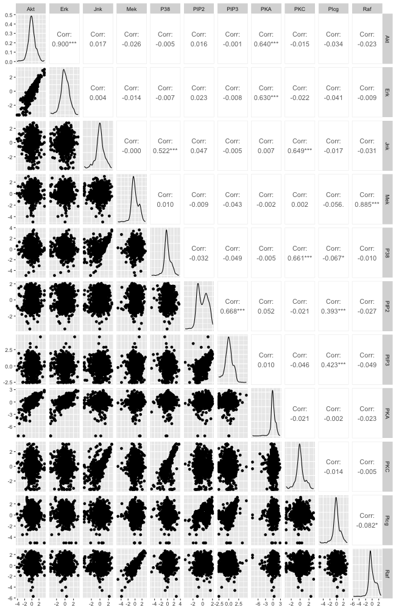

# Problem 3: Learning Bayesian networks from protein data

## Preparation to run the code

Setting seed for reproducibility and loading packages.

```{r}
library("GGally")
library("BiDAG")
library("igraph")
```

## Loading data

```{r}
data <- read.table("2005_sachs_2_cd3cd28icam2_log_std.csv", sep=",", header=TRUE)
```

## Variables and observations

```{r}
num_variables <- ncol(data)
num_observations <- nrow(data)
```

## Visualisation of transformed data

```{r}
png(file="plot.png", width=650, height=1000)
ggpairs(data, progress=FALSE)
dev.off()
```



\newpage

## Defining functions

```{r}
splitting_data <- function(data) {
    # Shuffling data
    indices <- 1:nrow(data)
    indices <- sample(length(indices))

    # Splitting data
    train_size <- ceiling(nrow(data)*0.8)
    train_indices <- indices[1:train_size]
    test_indices <- indices[(train_size+1):(length(indices))]

    # Checking if there is no overlap
    if(length(unique(c(train_indices, test_indices))) != length(c(train_indices, test_indices))) {
        print("Overlap!")
    }

    train_data <- data[row.names(data) %in% train_indices, ]
    test_data <- data[row.names(data) %in% test_indices, ]

    split_data <- list("train_data"=train_data, "test_data"=test_data)

    return(split_data)
}

training_BN <- function(data, bgepar) {
    library("BiDAG")
    init_score_par <- scoreparameters("bge", data$train_data, bgepar)
    learnt_BN <- iterativeMCMC(init_score_par, verbose=FALSE)
    return(learnt_BN)
}

testing_BN <- function(data, BN, bgepar) {
    library("BiDAG")
    test_score_par <- scoreparameters("bge", data$test_data, bgepar)
    test_score <- scoreagainstDAG(test_score_par, BN$DAG)
    return(mean(test_score))
}

plot_DAG <- function(BN) {
    library("igraph")
    g <- graph_from_adjacency_matrix(BN$DAG)
    plot(g)
}

get_number_of_edges <- function(BN) {
    library("igraph")
    return(length(E(graph_from_adjacency_matrix(BN$DAG))))
}
```

## Default parameters

```{r}
bgepar <- list(am=1, aw=NULL, edgepf=1)
split_data <- splitting_data(data)
learnt_BN <- training_BN(split_data, bgepar)

mean_test_score <- testing_BN(split_data, learnt_BN, bgepar)
print(paste0("Average BGe score on testing data: ", mean_test_score))

plot_DAG(learnt_BN)
```

## Different parameters

```{r}
library(parallel)
library(doParallel)
```

```{r}
# Set the number of cores to use
num_cores <- detectCores()

# Register parallel backend
cl <- makeCluster(num_cores)
registerDoParallel(cl)
```

```{r}

ams <- c(10^(-5), 10^(-3), 10^(-1), 10, 10^2)

res <- foreach(am = ams, .combine=c) %dopar% {
    set.seed(42)
    bgepar <- list(am=am, aw=NULL, edgepf=1)
    numbers_of_edges <- c()
    mean_test_scores <- c()
    for(i in 1:10) {
        RNGkind("L'Ecuyer-CMRG")
        split_data <- splitting_data(data)
        learnt_BN <- training_BN(split_data, bgepar)
        number_of_edges <- get_number_of_edges(learnt_BN)
        numbers_of_edges <- append(numbers_of_edges, number_of_edges)
        mean_test_score <- testing_BN(split_data, learnt_BN, bgepar)
        mean_test_scores <- append(mean_test_scores, mean_test_score)
    }
    return(c(am, mean(numbers_of_edges), mean(mean_test_scores)))
}
```

```{r}
stopCluster(cl)
```

```{r}
res_m <- t(matrix(data=res, nrow=5, ncol=3, byrow=TRUE))
rownames(res_m) <- c("Parameter am", "Average number of edges", "Average BGe score of the test data")
print(res_m)
```

## Retraining the best BN 

The best BN (based on the highest BGe score) was the one with $\alpha_m = 10^{-1}$.

```{r}
set.seed(42)
bgepar <- list(am=10^(-1), aw=NULL, edgepf=1)
split_data <- splitting_data(data)
learnt_BN <- training_BN(split_data, bgepar)

mean_test_score <- testing_BN(split_data, learnt_BN, bgepar)
print(paste0("Average BGe score on testing data: ", mean_test_score))

plot_DAG(learnt_BN)
```

## Render this .rmd into a pdf

```{r, eval=FALSE}
library(rmarkdown)
render("1.Rmd", pdf_document(TRUE), "1.pdf") # TRUE adds table of content
```
